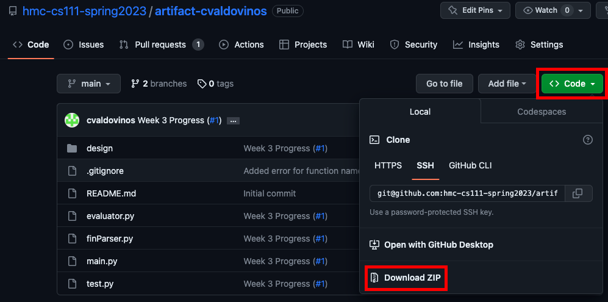
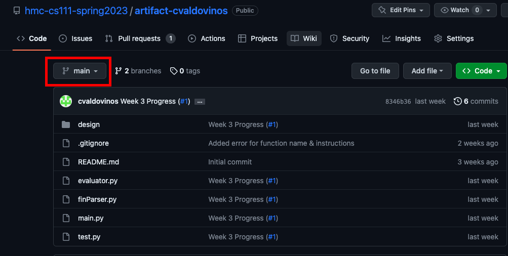
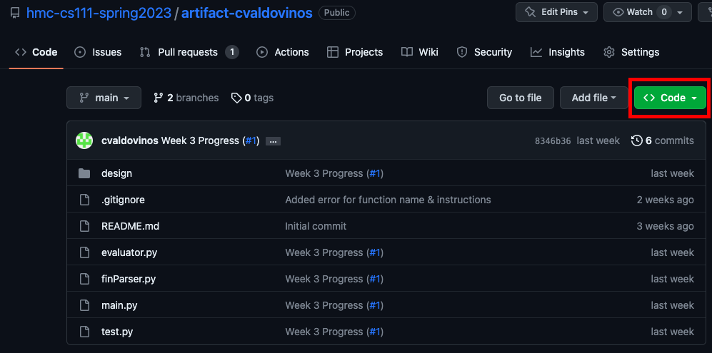
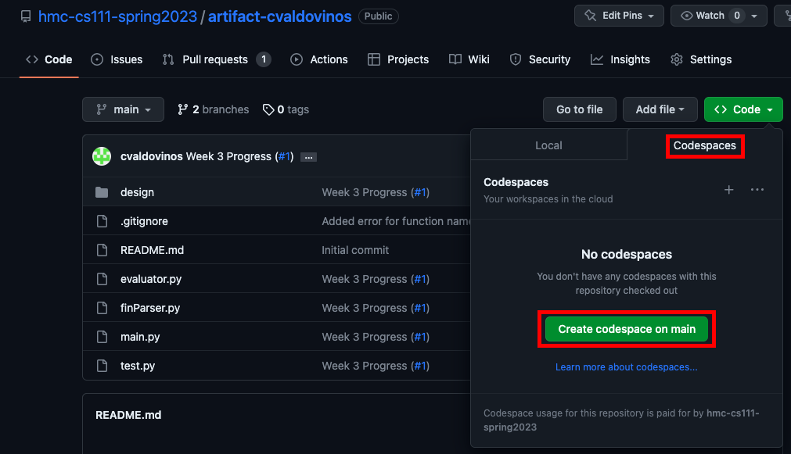
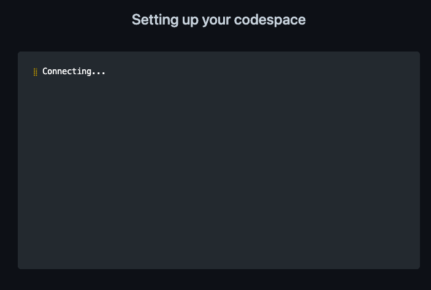
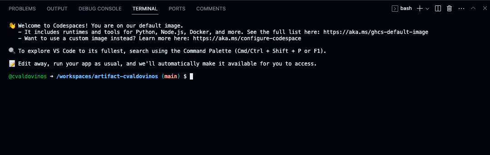

<a name="readme-top"></a>

# Finance Calculator
<!-- TODO: Add logo/image here -->
<!-- LOGO IDEA: -->
<!-- 
FIN
ANC
]E[ -->

<!-- 
CAL
CUL
ATO
]R[
-->

<!-- If there are buttons on the right I can add:
NPV
PV
FV
IRR
-->

Finance Calculator is a tool that allows users to perform finance calculations using natural language instead of using formulas in traditional software like Microsoft Excel or Google Sheets.

<details open>
  <summary><h2 style="display: inline-block">Table of Contents</h2></summary>
  <ol>
    <li><a href="#tools-used">Tools Used</a></li>
    <li>
        <a href="#methods-to-run-program">Methods to Run Program</a>
        <ul>
            <li><a href="#method-1-downloading-repository"> Downloading repository</a></li>
            <li><a href="#method-2-cloning-repository">Cloning repository</a></li>
            <li><a href="#method-3-using-github-codespaces">Using GitHub Codespaces</a></li>
        </ul>
    </li>
    <li><a href="#usage">Usage</a></li>
    <li><a href="#design">Design</a></li>
    <li><a href="#contact">Contact</a></li>
  </ol>
</details>

### Tools Used
[![Python][Python Badge]][Python-url]

[![Pytest][Pytest Badge]][Pytest-url]

<p align="right">(<a href="#readme-top">back to top</a>)</p>

<!-- GETTING STARTED -->
## Methods to Run Program
I will describe 3 ways to access Finance Calculator:
<!-- TODO: Replace this if the repo name changes -->

### Method 1: Downloading repository
1. On the repository, click the '<> Code' button and then select 'Download ZIP'



2. Navigate to where that file was downloaded. If your downloaded files automatically save in your 'Downloads' folder then you can do so by running the following command:
```
cd ~/Downloads
```

3. Unzip the file using the following command:
```
unzip artifact-cvaldovinos-main.zip
```
This will create a folder titled "artifact-cvaldovinos-main"

4. Navigate into that folder using
```
cd artifact-cvaldovinos-main
```

5. Run the following command to install the numpy_financial library:
```
pip install numpy_financial
```

6. Then to start the Finance Calculator, you just need to run
```
python main.py
``` 

7. Now you'll get the prompt from the calculator to start typing! If you ever want to stop the program, you can type  ```exit``` or ```quit``` to stop it from running.

<p align="right">(<a href="#readme-top">back to top</a>)</p>

### Method 2: Cloning repository
*Prequistes: Must have git installed and ssh keys set up on device*

1. Open your terminal, navigate to the folder you would like to clone to and run the following command:
```
git clone git@github.com:hmc-cs111-spring2023/artifact-cvaldovinos.git
```

2. Move into the directory where you have cloned the repository. If you copied the command above then that can be done using the command:
```
cd artifact-cvaldovinos
```

3. Run the following command to install the numpy_financial library:
```
pip install numpy_financial
```

4. Then to start the Finance Calculator, you just need to run
```
python main.py
``` 

5. Now you'll get the prompt from the calculator to start typing! If you ever want to stop the program, you can type  ```exit``` or ```quit``` to stop it from running.

<p align="right">(<a href="#readme-top">back to top</a>)</p>

### Method 3: Using GitHub Codespaces
*Note: This format may be deprecated depending on future repository permissions*

1. From the repository, verify that you are on the correct branch you would like to use (for the full application, use main) in the top left 



2. Click on the green button in the top right that reads "<> Code"



3. Select the Codespaces tab and on the first time accessing this you will see "Create codespaces on main". Click that button to start up a virtual environment.



4. You will be prompted with a screen reading "Setting up your codespace". This will take a few seconds to load and you do not have to do anything here besides wait.



5. Now you should be prompted with a terminal at the bottom of the screen that looks something like this:


*If the terminal is not there then you can go ahead and drag from the bottom of the screen or press CTRL+SHIFT+` to open it.*

6. Run the following command to install the numpy_financial library:
```
pip install numpy_financial
```

7. Then to start the Finance Calculator, you just need to run
```
python main.py
``` 

8. Now you'll get the prompt from the calculator to start typing! If you ever want to stop the program, you can type  ```exit``` or ```quit``` to stop it from running.

<p align="right">(<a href="#readme-top">back to top</a>)</p>


<!-- USAGE EXAMPLES -->
## Usage

Finance calculator can be used to calculate any of the following:

* Net Present Value (NPV)
* Internal Rate of Return (IRR)
* Present Value (PV)
* Future Value (FV)

To do so, you simply write two sentences, the first beginning with "Given" and then you define the given variables needed to perform the calculation. The second is where you state which calculation you would like to perform.

Specifically, there are 3 valid formats for inputs:
1. Given W, X, Y, and Z. What is the A?
2. Given X and Y. What is the A?
3. Given X. What is the A?

Where A is one of the following (case insensitive):
* Net Present Value / NPV
* Internal Rate of Return / IRR
* Present Value / PV
* Future Value / FV

And where W, X, Y, and Z are the inputs for those functions.

<p align="right">(<a href="#readme-top">back to top</a>)</p>

## Sample Uses

I will provide a set of problems and demonstrate how FinanceCalculator can be used to calculate the answer.

### Sample Problem 1:

A company is considering investing $500,000 in a project that will generate cash inflows of $100,000 per year for the next 6 years. The cost of capital for this project is 8%. Calculate the NPV of the project.

### Input:
    Given r = 0.08 and cash flows = [-500000, 100000, 100000, 100000, 100000, 100000, 100000]. What is the NPV?

### Output:
```-37712.033603881086```

### Sample Problem 2:
A manufacturing company is considering a new production line that will cost $2 million to install. The production line is expected to generate cash flows of $500,000 per year for the next 7 years. What is the IRR of the project?

### Input:
    Given cash flows = [-2000000, 500000, 500000, 500000, 500000, 500000, 500000, 500000]. What is the IRR?

### Output:
```0.16326709023510078```

### Sample Problem 3:

You are planning to buy a car that costs $25,000. You can afford monthly payments of $500 for 5 years. If the interest rate is 4%, what is the maximum amount you can borrow?

### Input:
    Given r = 4%/12, 12*5 periods, and $500 payments. What is the PV?

### Output:
```27149.53445061747```

### Sample Problem 4:

You are planning to save $200 per month for the next 5 years in an account with an annual interest rate of 6%. How much money will you have in the account at the end of 5 years?

### Input:
    Given r = 6%/12, 5*12 periods, $200 payments, and a present value of 0. What is the FV?

### Output:
```13954.0061019723```


<!-- DESIGN -->
## Design

<!-- This project was originally designed as a final project submission for the course CSCI-111 Domain Specific Languages, taught by Professor Benjamin Wiedermann at Harvey Mudd College.  -->
The goal of this project was to create a large project in which students would design, implement, and evaluate their own domain-specific language.

This project was originally planned out in-depth in the file [project.md](/design/project.md).

<p align="right">(<a href="#readme-top">back to top</a>)</p>


<!-- CONTACT -->
## Contact

Christian Valdovinos - cvaldovinos@hmc.edu

<p align="right">(<a href="#readme-top">back to top</a>)</p>


<!-- MARKDOWN LINKS & IMAGES -->
<!-- https://www.markdownguide.org/basic-syntax/#reference-style-links -->
[Python Badge]: https://img.shields.io/badge/python-3670A0?style=for-the-badge&logo=python&logoColor=ffdd54
[Python-url]: https://www.python.org/
[Pytest Badge]: https://img.shields.io/badge/pytest-6.2.4-blue?logoColor=white&logo=pytest
[Pytest-url]: https://pypi.org/project/pytest/
